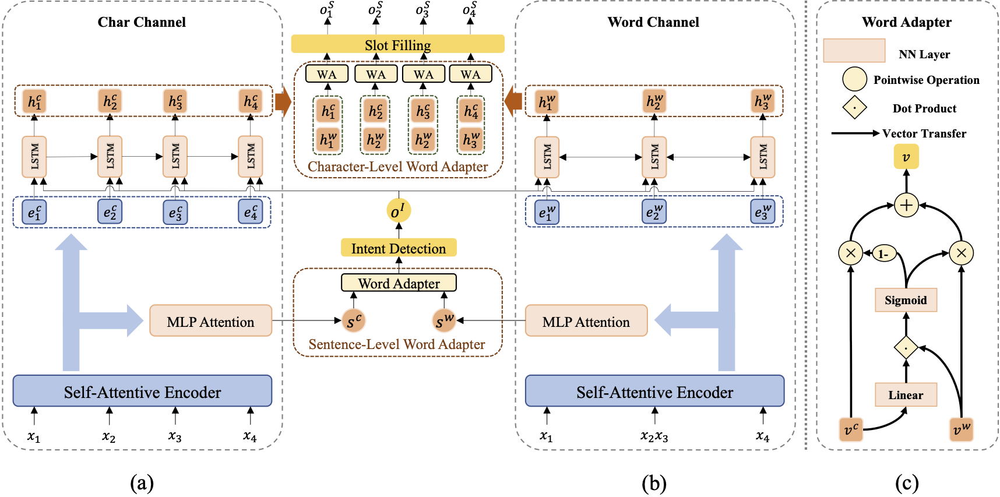

# MLWA-Chinese-SLU

This repository contains the PyTorch implementation of the paper: 

**[Injecting Word Information with Multi-Level Word Adapter for Chinese Spoken Language Understanding](https://arxiv.org/abs/2010.03903)**. 
Dechuan Teng, Libo Qin, Wanxiang Che, Sendong Zhao, Ting Liu. 
***ICASSP 2021***.

## Architecture



## Requirements
Our code is based on Python 3.7.6 and PyTorch 1.1. Requirements are listed as follows:
> - torch==1.1.0
> - transformers==2.4.1
> - numpy==1.18.1
> - tqdm==4.42.1
> - seqeval==0.0.12

We highly suggest you using [Anaconda](https://www.anaconda.com) to manage your python environment.

## How to Run it

### Quick start
The script **train.py** acts as a main function to the project, you can run the experiments by replacing the unspecified options in the following command with the corresponding values.

```shell
    CUDA_VISIBLE_DEVICES=$1 python train.py -dd ${dataDir} -sd ${saveDir} -u -bs 16 -dr 0.3 \ 
        -ced 128 -wed 128 -ehd 512 -aod 128 -sed 32 -sdhd 64
```

### Ablation Study

For reproducing the results reported in our paper, we suggest you executing the following shell command:

```shell
    ./ablation_study.sh ${CUDA_VISIBLE_DEVICES} ${dataset_name} ${model_type} ${bies} ${tokenizer}
    
    # Examples for CAIS dataset
    ./ablation_study.sh "0" "cais" "full" "True" "ltp"
    ./ablation_study.sh "0" "cais" "none" "True" "ltp"
    ./ablation_study.sh "0" "cais" "full" "True" "pkuseg"
    ......
```

Refer to [ablation_study.sh](ablation_study.sh) for more details.

Due to some stochastic factors, It's necessary to slightly tune the hyper-parameters using grid search. If you have any question, please issue the project or email [me](mailto:dcteng@ir.hit.edu.cn) and we will reply you soon.

### Pre-trained Model

You can use the `-use_bert` parameter in `train.py` to replace the encoder of our model with BERT-Base-Chinese module. And the `-phed` parameter controls the percentage between the output dim of word-channel BiLSTM encoder and that of word-channel Self-Attention encoder. You can write a command like this:

```shell
    CUDA_VISIBLE_DEVICES=$1 python train.py -dd ${dataDir} -sd ${saveDir} -u \ 
        -use_bert -pehd 0.6 -ne 50 -lr 3e-5 -bs 16 -dr 0.3 -wed 128 -sed 32 -sdhd 64
```

## Citation

If you use any source codes or the datasets included in this repo in your work, please cite the following paper. The bibtex are listed below:
<pre>
@article{teng2020injecting,
  title={Injecting Word Information with Multi-Level Word Adapter for Chinese Spoken Language Understanding},
  author={Teng, Dechuang and Qin, Libo and Che, Wanxiang and Zhao, Sendong and Liu, Ting},
  journal={arXiv preprint arXiv:2010.03903},
  year={2020}
}
</pre>

## Issues/PRs/Questions 

Feel free to contact [me](mailto:dcteng@ir.hit.edu.cn) for any question or create issues/prs.

## Acknowledgement

https://github.com/yizhen20133868/StackPropagation-SLU

We are very grateful for their pytorch implementation of Stack-Propagation Framework for Spoken Language Understanding.